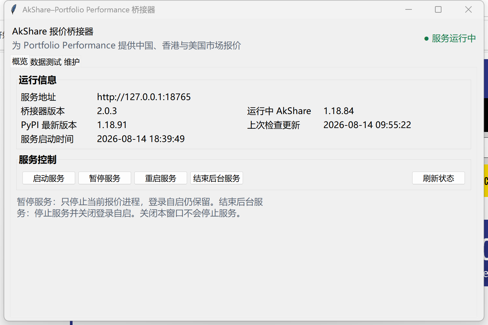
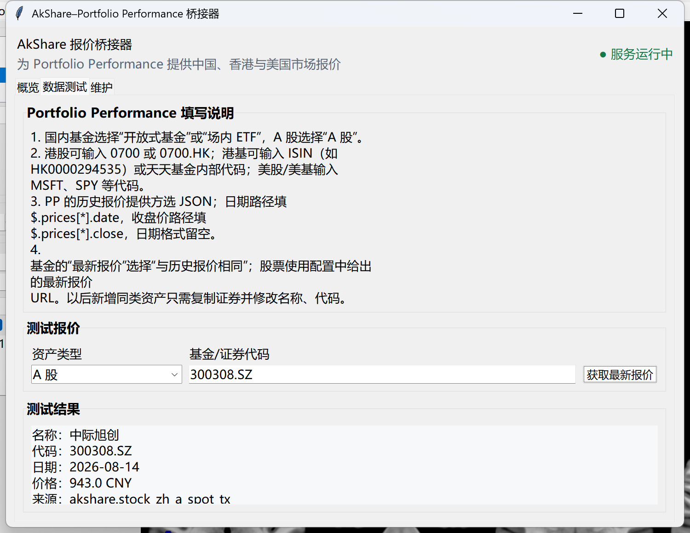
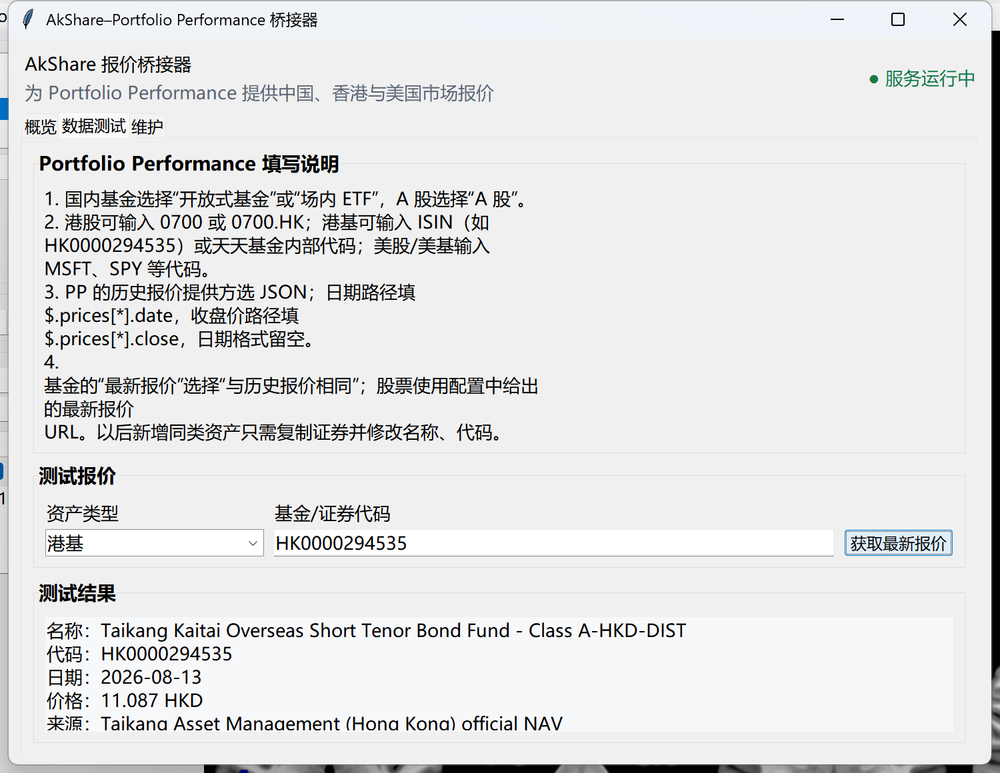

# AkShare–Portfolio Performance Bridge

[简体中文](README.md) | English

A local Windows desktop bridge that provides
[Portfolio Performance](https://www.portfolio-performance.info/) with JSON and CSV quote endpoints for mainland Chinese, Hong Kong, and U.S. markets. The application listens only on `127.0.0.1:18765`. It does not manage holdings or upload Portfolio Performance data to the internet.

Current version: `2.0.3`

## Features

- Historical and latest quotes for Chinese open-end funds, exchange-traded ETFs, and A-shares.
- Daily quotes for Hong Kong stocks, U.S. stocks, and U.S. mutual funds.
- Hong Kong fund lookup by provider-specific code and official NAV lookup by ISIN for supported fund companies.
- Automatic background service startup at Windows sign-in; closing the management window does not stop the service.
- Quote testing, Portfolio Performance configuration copying, and service pause/stop controls in the GUI.
- Stable AkShare version checks at startup and every 24 hours. Updates are installed only after user confirmation and can be rolled back.

## Screenshots

### Service overview



### A-share quote test



### Hong Kong fund ISIN test



## Installation

Download `AkSharePPBridge-Setup-2.0.3.exe` from [GitHub Releases](https://github.com/zohoho/akshare-portfolio-performance-bridge/releases). The installer performs a per-user installation and does not require administrator privileges. Version 2.0.3 keeps the existing AppId and installation directory, so it can upgrade an older installation in place while preserving settings, caches, logs, and the AkShare runtime.

- Default installation directory: `%LOCALAPPDATA%\Programs\AkSharePPBridge`
- Default data directory: `%LOCALAPPDATA%\AkSharePPBridge`
- Local service: `http://127.0.0.1:18765`
- Health endpoint: `http://127.0.0.1:18765/health`

The service starts immediately after installation and is registered as a per-user Windows scheduled task that runs at sign-in. Closing the GUI does not stop the service. **Pause Service** keeps sign-in startup enabled, while **Stop Background Service** stops the service and disables sign-in startup.

## Portfolio Performance Configuration

Select `JSON` as the historical quote provider:

```text
Date path:   $.prices[*].date
Close path:  $.prices[*].close
High path:   $.prices[*].high       # optional for stocks
Low path:    $.prices[*].low        # optional for stocks
Volume path: $.prices[*].volume     # optional for stocks
Date format: leave blank
```

For funds, the latest quote provider can be set to **Same as historical quotes**. When the `{TICKER}` placeholder is used, adding another asset of the same type only requires a different security ticker; the bridge service does not need to be reconfigured.

### Chinese Funds and ETFs

```text
Open-end fund history: http://127.0.0.1:18765/fund/{TICKER}.json?kind=open
Open-end fund latest:  http://127.0.0.1:18765/fund/{TICKER}/latest.json?kind=open
Exchange-traded ETF history: http://127.0.0.1:18765/fund/{TICKER}.json?kind=etf
Exchange-traded ETF latest:  http://127.0.0.1:18765/fund/{TICKER}/latest.json?kind=etf
```

Use `000305` to test an open-end fund.

### A-Shares

Supported ticker formats include `300308.SZ`, `600519.SH`, `600519.SS`, Beijing Stock Exchange suffixes, and six-digit tickers without a suffix. Historical quotes use Tencent first and Eastmoney as a fallback. Latest quotes use Tencent's whole-market snapshot and are cached for 30 seconds.

```text
History: http://127.0.0.1:18765/stock/{TICKER}.json
Latest:  http://127.0.0.1:18765/stock/{TICKER}/latest.json
```

### Hong Kong and U.S. Stocks

Hong Kong stocks can be entered as `0700` or `0700.HK`. U.S. stocks use tickers such as `MSFT` and `AAPL`.

```text
Hong Kong stock history: http://127.0.0.1:18765/stock/hk/{TICKER}.json
Hong Kong stock latest:  http://127.0.0.1:18765/stock/hk/{TICKER}/latest.json
U.S. stock history: http://127.0.0.1:18765/stock/us/{TICKER}.json
U.S. stock latest:  http://127.0.0.1:18765/stock/us/{TICKER}/latest.json
```

### Hong Kong and U.S. Funds

Hong Kong funds can use Eastmoney's Hong Kong fund code. Funds from supported providers can also be entered directly by ISIN. For example, `HK0000294535` is retrieved from Taikang Asset Management (Hong Kong)'s official website and strictly matched to the `Class A-HKD-DIST` share class denominated in HKD.

```text
Hong Kong fund history: http://127.0.0.1:18765/fund/hk/{TICKER}.json
Hong Kong fund latest:  http://127.0.0.1:18765/fund/hk/{TICKER}/latest.json
U.S. fund history: http://127.0.0.1:18765/fund/us/{TICKER}.json
U.S. fund latest:  http://127.0.0.1:18765/fund/us/{TICKER}/latest.json
```

Every historical JSON endpoint also has a corresponding `.csv` endpoint. Append `?refresh=1` to force an upstream refresh, or use `?start=2025-01-01&end=2025-12-31` to limit the historical date range.

## Running from Source and Testing

Windows and Python 3.12 are required:

```powershell
py -3.12 -m venv .venv
.\.venv\Scripts\python.exe -m pip install -r requirements.txt
$env:AKSHARE_PP_DATA_DIR = "$PWD\.local-data"
.\.venv\Scripts\python.exe bridge.py
```

Run the test suite:

```powershell
.\.venv\Scripts\python.exe -m unittest discover -s tests -v
```

Tests do not modify the production `%LOCALAPPDATA%\AkSharePPBridge` data directory.

## Building the Windows Installer

Python 3.12, PyInstaller, and Inno Setup 6 are required:

```powershell
py -3.12 -m venv .venv-build
.\.venv-build\Scripts\python.exe -m pip install -r requirements.txt -r requirements-build.txt
.\build_app.ps1 -BuildPython .\.venv-build\Scripts\python.exe
.\build_installer.ps1
```

If Inno Setup is installed in a non-standard location, pass it explicitly:

```powershell
.\build_installer.ps1 -IsccPath "C:\Program Files (x86)\Inno Setup 6\ISCC.exe"
```

The installer is written to `dist/`. The build scripts also accept explicit `-RuntimePython` and `-RuntimeSitePackages` arguments, allowing packages to be generated from a separate clean runtime environment.

## Data Sources and Security

The bridge uses AkShare, Yahoo Finance, Tencent, Eastmoney, and public endpoints provided by supported fund companies. If an upstream source fails while an older local cache is available, the service returns the cached data with `stale: true`.

The application listens only on the loopback interface, and control endpoints use a locally generated random token. Quotes are intended only for personal investment record-keeping and must not be treated as trading advice. You are responsible for checking each data source's terms and the rules applicable in your jurisdiction.

## Version 2.0.3

- Supports Chinese funds, ETFs, A-shares, Hong Kong stocks, U.S. stocks, Hong Kong funds, and U.S. funds.
- Yahoo historical quotes include complete daily OHLC and volume data.
- Adds Hong Kong fund ISIN recognition; `HK0000294535` uses the official NAV published by Taikang Asset Management (Hong Kong).
- Adds configuration guidance, service pause/stop controls, sign-in startup management, and safe AkShare update rollback.

## License and Disclaimer

This project is released under the [GNU General Public License v3.0](LICENSE) and comes with no warranty. Third-party components and data sources retain their respective licenses and rights; see [THIRD_PARTY_NOTICES.md](THIRD_PARTY_NOTICES.md).

Portfolio Performance and AkShare are independent projects. This bridge is an unofficial community tool and is not sponsored, endorsed by, or affiliated with either project.
